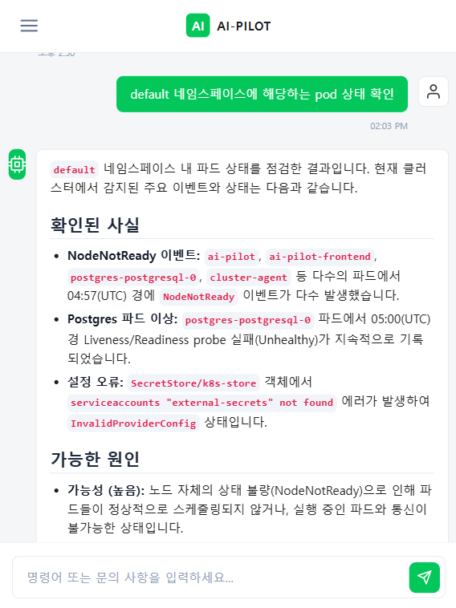
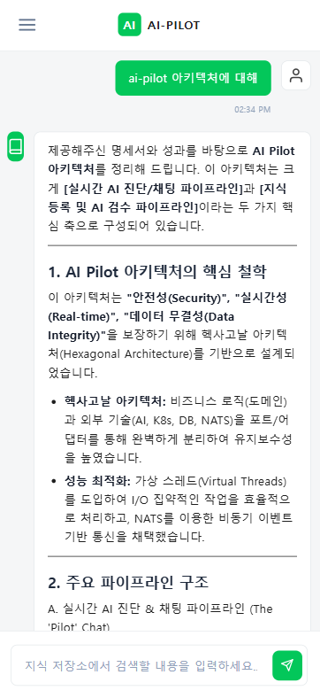
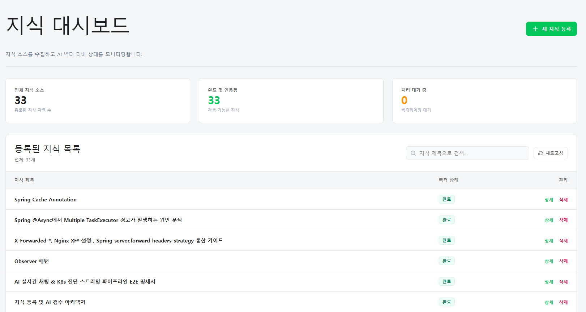
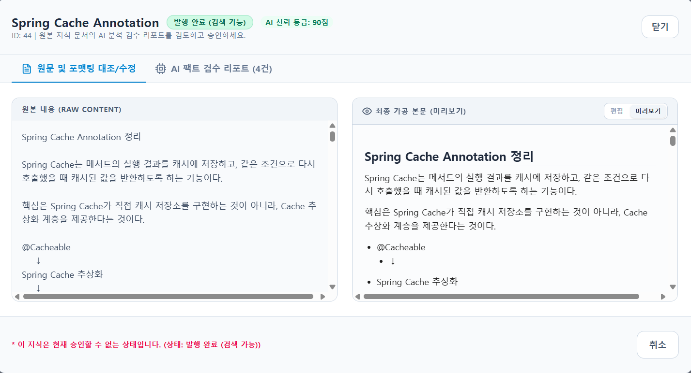
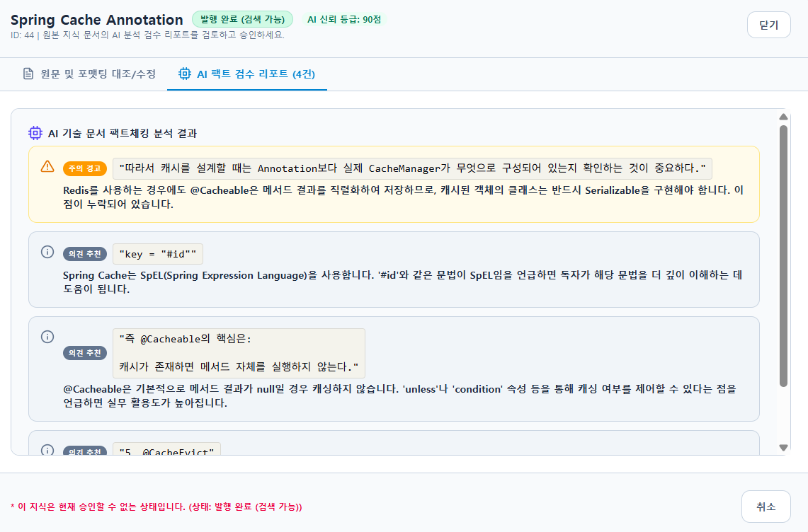
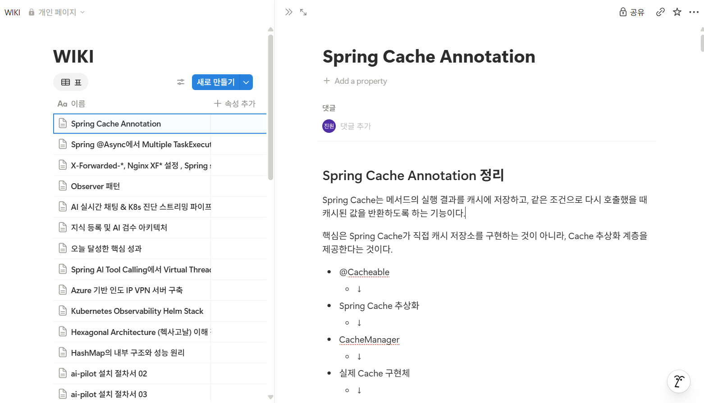

# AI-Pilot

Kubernetes 환경에서 AI를 활용해 장애를 진단하고 운영 작업을 지원하는 개인 DevOps Platform이자,
회사와 집을 오가며 정리한 기술 지식을 검수받고 기록·검색하는 개인 지식 저장소입니다.

## Overview

k3s 기반 홈랩 클러스터 위에서 동작하며, Tailscale VPN을 통해 PC, 개인 노트북, 모바일 등
어디서든 접근할 수 있습니다. 크게 두 가지 축으로 구성되어 있습니다.

1. **AI 기반 Kubernetes 진단**: 채팅으로 장애 상황을 물어보면 Go Cluster Agent가 실제 클러스터
   상태를 조회하고, AI가 이를 분석해 진단 결과를 스트리밍으로 제공합니다.
2. **개인 지식 저장소 (Knowledge Guardian)**: 정리한 기술 노트를 AI가 사실관계 기준으로 1차
   검수하고, 최종 승인은 항상 사람이 하는 구조로 지식을 축적합니다.
3. **RAG 기반 지식 검색**: 승인된 지식을 임베딩하여 벡터 DB에 저장하고, 질문 시 유사도 검색으로
   관련 지식을 Context로 주입해 Gemini가 개인 지식 기반으로 답변합니다.

## Motivation

업무 중 반복적으로 마주치는 문제(에러 상황, 운영 명령어, 트러블슈팅 노하우)나 스스로 학습한 내용을
정리해두고 싶었지만, 두 가지 제약이 있었습니다.

첫째, 외부 PC에서는 개인 인프라(k3s 클러스터)에 직접 접근할 수 없다는 점.
둘째, 혼자 정리한 내용에는 사실 오류나 애매한 서술이 섞여 들어갈 수 있고, 이를 나중에 실무에서 그대로 활용하면 치명적인 실수로 이어질 수 있다는 점

이를 해결하기 위해 다음 흐름을 구축했습니다.

1. PC에서 웹 기반 AI 또는 CLI 도구에 질문하고, 정리된 내용을 Markdown 형식으로 요청
2. 해당 Markdown을 AI-Pilot의 지식 저장소에 등록하면, AI가 "Knowledge Guardian" 역할로 기술적
   사실관계를 검수하여 오류(CRITICAL)·애매한 서술(WARNING)·추가 학습 제안(SUGGESTION)을 분류하고
   100점 만점 점수를 매김
3. 사용자가 검수 결과를 직접 확인하고 최종 승인하면, 원본(raw)·AI 요약(summary)·임베딩 값이
   PostgreSQL에 저장되는 동시에 Notion에도 별도로 저장됩니다. 두 저장소는 동기화 관계가 아니라
   각각 독립적으로 존재하며, 한쪽에서 삭제해도 다른 쪽에는 영향을 주지 않습니다.

가장 큰 차별점은 특정 기기나 장소에 종속되지 않고 폰이나 외부 PC에서도 접근 가능하면서, 동시에
저장되는 지식의 정확성까지 검증한다는 점입니다.

## Key Features

- **AI 기반 Kubernetes 장애 진단**: 채팅 질의 → NATS request-reply로 Go Cluster Agent에 진단
  요청 → 실제 클러스터 상태 조회 → AI 분석 → SSE 스트리밍 응답
- **가상 스레드 기반 NATS 통신**: Reactor 같은 별도 비동기 레이어 없이, 가상 스레드가 NATS의
  blocking request-reply 호출을 직접 수용하는 구조
- **AI 기술 검수 (Knowledge Guardian)**: 정리한 지식을 저장하기 전에 AI가 사실관계를 검수하고
  심각도별로 이슈를 분류, 최종 승인은 항상 사람이 하도록 설계
- **이원화된 지식 저장**: PostgreSQL(원본+요약+임베딩)과 Notion(열람/편집용 UI)에 독립적으로 저장
- **RAG 기반 지식 챗봇**: 사용자 질문 → 벡터 유사도 검색(Cosine Similarity)으로 관련 지식 추출 → System Prompt에 Context 주입 → Gemini SSE 스트리밍 응답. 관련 지식이 없으면 일반 지식으로 폴백.
- **GitOps 기반 배포**: ArgoCD를 통한 자동 배포 (자세한 내용은 [ai-pilot-infra](../ai-pilot-infra) 참고)

## Tech Stack

| 영역 | 기술 |
|---|---|
| Frontend | React |
| Backend | Spring Boot 4.1.0 / Java 25 (Virtual Threads) |
| AI | Spring AI 2.0.0 / Google Gemini |
| 메시징 | NATS 2.25.3 (request-reply) |
| 클러스터 제어 | Go (Cluster Agent) |
| 인증 | Spring Security + JWT |
| 데이터베이스 | PostgreSQL (원본 + 요약 + 벡터 임베딩 저장 / Cosine 유사도 검색) |
| 외부 연동 | Notion |
| API 문서 | SpringDoc OpenAPI 3.0.3 |
| 인프라 | k3s, Traefik, ArgoCD, Helm |
| 접근 | Tailscale VPN |
| 모니터링 | Prometheus, Grafana, Loki |

## Architecture

전체 아키텍처 다이어그램과 상세 흐름은 [docs/architecture.md](./docs/architecture.md)를 참고하세요.

AI-Pilot 아키텍처는 **"안전성(Security)", "실시간성(Real-time)", "데이터 무결성(Data Integrity)"**을 보장하기 위해 헥사고날 아키텍처(Hexagonal Architecture)를 기반으로 설계되었습니다.

### 1. 실시간 AI 진단 & 채팅 파이프라인 (The 'Pilot' Chat)
사용자가 실시간으로 K8s 상태를 진단하거나 지식 검색(RAG)을 요청할 때 사용하는 SSE 기반 스트리밍 파이프라인입니다.

- **보안 (1회용 티켓 인증):** JWT를 브라우저의 EventSource에 직접 노출하지 않기 위해, 서버 측에서 SecureRandom 256-bit 난수로 1회용 티켓을 발급합니다. 클라이언트는 이 티켓으로 SSE 연결을 맺으며, 연결 즉시 서버 메모리에서 티켓이 파기되어 재사용을 원천 차단합니다.
- **동적 툴 호출 (Dynamic Tool Calling):** Spring AI ChatClient와 ToolRegistry를 활용하여 질문 의도에 따라 `K8sDiagnosticTool`(Go Agent 연동) 또는 `KnowledgeTool`(PgVector RAG)을 동적으로 선택합니다.
- **SSE 방어 2-Tier 구조:** 컨트롤러 레벨(`onErrorResume`)과 글로벌 핸들러 레벨(`isSseRequest`)에서 이중으로 예외를 방어하여 불완전한 네트워크 단절로 인한 톰캣 스레드 릭과 서버 크래시를 원천 차단합니다.

*(Ops AI Assistant: NodeNotReady, Probe 실패 등 실시간 K8s 이벤트를 분석하고 원인 및 조치 방법을 스트리밍으로 제공)*

 

*(지식 AI 어시스턴트: 등록된 개인 지식을 RAG로 검색하여 구조화된 마크다운 형식으로 답변)*

### 2. 지식 등록 및 AI 검수 파이프라인 (Knowledge Pipeline)
지식을 등록하고 외부 시스템(Notion, PgVector)에 동기화할 때 데이터 유실을 0%로 보장하기 위한 이벤트 기반 파이프라인입니다.

- **비동기 AI 가공:** 지식 저장 요청 시, I/O 블로킹을 최소화하기 위해 가상 스레드(Virtual Thread)를 사용하여 Gemini AI가 지식을 비동기적으로 검수하고 포맷팅합니다.
- **데이터 무결성 (Transactional Outbox):** 외부 서비스(Notion/PgVector) 호출 정보와 Outbox 테이블 기록을 동일한 DB 트랜잭션으로 묶어, 서버 크래시 등 시스템 장애 시에도 이벤트 데이터 유실을 완벽히 방지합니다.
- **NATS JetStream 연동:** 커밋된 이벤트를 NATS 분산 메시징 큐로 전달하며, `FOR UPDATE SKIP LOCKED` 쿼리를 사용해 다중 서버 환경에서도 데드락 없이 안전하게 이벤트를 병렬 처리합니다.
- **상태 집계:** `KnowledgeStatusAggregator`가 다수의 비동기 작업(Notion API 적재, Vector DB 임베딩)의 완료 상태를 추적하여 최종적으로 지식을 `PUBLISHED` 상태로 일관성 있게 전이시킵니다.

*(지식 대시보드: 전체 지식 소스 33개가 모두 벡터 DB에 동기화 완료된 상태 모니터링)*

 

*(AI 자동 포맷팅: 사용자가 입력한 원본 텍스트(좌)를 AI가 마크다운 기반 정형 문서(우)로 자동 변환)*

 

*(Knowledge Guardian: AI가 기술적 사실관계를 검수하고 "주의 경고", "의견 추천" 등 심각도별로 리포팅)*

 

*(이원화 저장: 승인된 지식은 PostgreSQL뿐만 아니라 Notion WIKI에도 Transactional Outbox를 통해 유실 없이 자동 동기화)

## Design Decisions

기술 선택 이유와 트레이드오프는 [docs/decisions](./docs/decisions)에 ADR 형태로 기록합니다.

## Troubleshooting

실제로 겪은 문제와 해결 과정은 [docs/troubleshooting](./docs/troubleshooting)에 기록합니다.

## Deployment

이 저장소는 애플리케이션 코드만 관리하며, 배포/인프라 구성은
[ai-pilot-infra](../ai-pilot-infra) 저장소에서 GitOps(ArgoCD) 기반으로 관리합니다.

