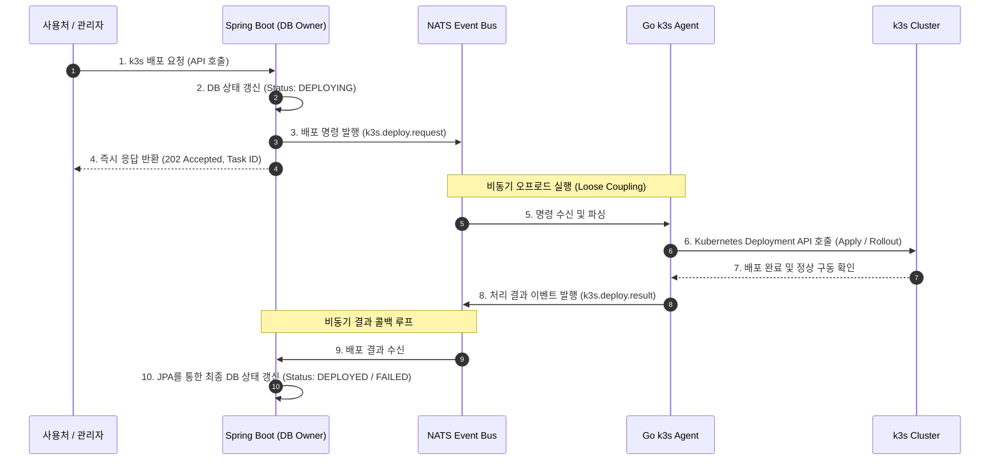

# Architecture Design Record: Spring Boot & Go Control Plane Separation using NATS

본 문서는 **지식 검수 및 요약 시스템(ai-pilot)**의 서비스 확장 단계에서 **Spring Boot(Brain/Orchestrator)**와 **Go(k3s Actuator/Executor)**의 역할을 분리하고, 메시지 브로커(**NATS**)를 통하여 데이터 일관성(Database Consistency)을 유지하며 비동기로 통신하는 **제어 플레인 분리 구조(Control Plane Separation)** 설계 명세서입니다.

---

## 1. 아키텍처 경계 분리 규칙 (Architecture Boundary)

각 레이어는 본연의 책임 영역을 엄격히 격리하며 서로의 영역을 직접 침범하지 않습니다.

```text
+---------------------------------------+
|          Spring Boot (Brain)          |
|  - 도메인 비즈니스 로직 (DDD core)        |
|  - 데이터베이스 (DB/JPA) 유일 소유권      |
|  - Notion 연동 동기화 및 상태 기계 관리    |
+---------------------------------------+
                   │  ▲
   k3s.deploy.req  │  │  k3s.deploy.result
   (NATS Publish)  ▼  │  (NATS Publish)
+---------------------------------------+
|             NATS Event Bus            |
+---------------------------------------+
                   │  ▲
                   ▼  │
+---------------------------------------+
|          Go Agent (Actuator)          |
|  - k3s 클러스터 직접 제어 (client-go)   |
|  - 인프라 배포 명령 수신 및 실행          |
|  - MCP Server 구동을 통한 LLM 툴 제공     |
+---------------------------------------+
```

---

## 2. "결국 DB 업데이트는 어떻게 치는가?" - 비동기 이벤트 콜백 루프

"Go가 인프라 작업을 실행하는데, 결국 DB 상태를 성공/실패로 갱신하려면 동기 응답을 받아야 하지 않는가?"에 대한 아키텍처적 해답은 **NATS를 통한 비동기 이벤트 콜백(Asynchronous Event Callback) 루프**입니다. 

동기식 HTTP/gRPC 커넥션을 맺고 무한 대기하는 대신, 양방향 토픽 구독을 통해 **최종 일관성(Eventual Consistency)**을 달성합니다.

### 🔄 데이터 흐름 시퀀스 다이어그램



---

## 3. NATS Subject(토픽) 설계 명세

두 시스템 간의 통신은 사전에 정의된 Subject 구조를 엄격히 준수합니다.

### 1) 배포 명령 토픽
* **Subject**: `k3s.deploy.request`
* **방향**: Spring Boot (Publish) ➔ Go k3s Agent (Subscribe)
* **목적**: 특정 클러스터에 지정된 이미지를 배포 및 롤아웃하도록 명령을 전달합니다.

### 2) 배포 결과 콜백 토픽
* **Subject**: `k3s.deploy.result`
* **방향**: Go k3s Agent (Publish) ➔ Spring Boot (Subscribe)
* **목적**: 인프라 배포의 성공/실패 여부 및 생성된 Pod 메타데이터를 백엔드로 회신하여 DB 상태를 최종 일관화합니다.

---

## 4. 메시지 페이로드 스키마 (Data Schema)

### 📄 `k3s.deploy.request` (요청 스키마)
```json
{
  "taskId": "task-uuid-12345",
  "knowledgeId": 3,
  "clusterName": "k3s-local-edge",
  "namespace": "mcp-apps",
  "deploymentName": "mcp-pilot-worker",
  "image": "docker.io/library/mcp-worker:20260625",
  "replicas": 3,
  "timestamp": "2026-06-25T00:40:00Z"
}
```

### 📄 `k3s.deploy.result` (응답/결과 스키마)
```json
{
  "taskId": "task-uuid-12345",
  "knowledgeId": 3,
  "status": "SUCCESS",
  "errorMessage": null,
  "deploymentDetails": {
    "activeReplicas": 3,
    "availableReplicas": 3,
    "generation": 2,
    "deployedAt": "2026-06-25T00:41:15Z"
  },
  "timestamp": "2026-06-25T00:41:20Z"
}
```
*만약 배포 중 에러가 발생한 경우, `status`는 `"FAILED"`가 되며 `errorMessage`에 상세 k8s 이벤트 에러 내용이 적재되어 회신됩니다.*

---

## 5. 예외 처리 및 롤백 정책 (Failure Recovery)

1. **Go Agent 실행 에러**:
   * Go 에이전트가 k3s 배포 중 권한 문제, 이미지 풀 에러(ImagePullBackOff), 리소스 부족 등으로 실패할 경우, 해당 에러 내용을 고스란히 `k3s.deploy.result` 페이로드의 `errorMessage`에 실어 `FAILED` 상태로 NATS에 던집니다.
   * Spring Boot는 이를 받아 해당 `knowledgeId` 레코드의 상태를 `FAILED_AT_DEPLOYMENT`로 안전하게 롤백 마킹하고 관리자 알림(Alert)을 유도합니다.
2. **NATS 메시지 유失 방지 (JetStream)**:
   * 단순 Pub/Sub은 수신자가 살아있지 않으면 유실되지만, NATS의 `JetStream` 영속성 옵션을 켜두면 Go 에이전트가 점검 등으로 잠시 내려가더라도 복구되는 즉시 대기 중인 배포 명령 메시지를 안전하게 가져가서 실행합니다.
3. **네트워크 유실 및 Timeout**:
   * Spring Boot는 배포 요청을 던진 뒤, 일정 시간(예: 5분) 동안 `k3s.deploy.result` 응답이 오지 않는 경우 스케줄러를 통해 **배포 타임아웃** 처리를 수행하여 트랜잭션 락이 영원히 묶이는 현상을 차단합니다.
