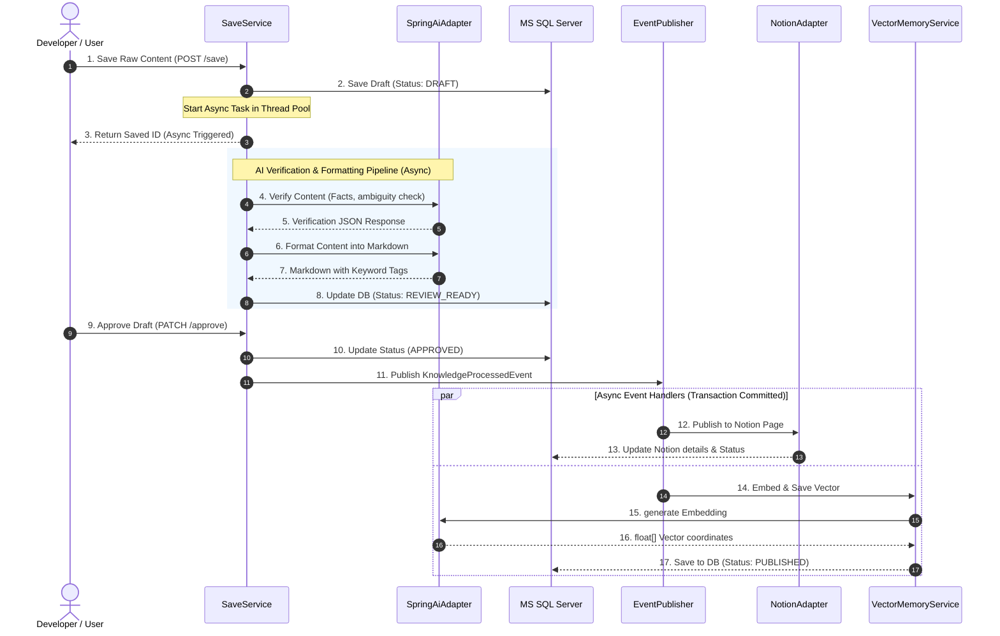

# Project Analysis Report: spring-ai-mcp-k8s-operator (mcp-pilot)

This document provides a detailed overview and analysis of the **`spring-ai-mcp-k8s-operator` (Spring Boot App: `mcp-pilot`)** project.

---

## 1. System Overview & Technology Stack

The project is a Spring Boot application designed as a **Knowledge Verification & Publishing Pipeline** utilizing Spring AI and LLMs to process developer documentation, audit factual errors, format them into clean markdown, and publish them to Notion and a local vector search store.

### Key Technology Stack
*   **Java Version**: Java 25 (utilizing virtual threads, modern switch expressions, and prepared for SIMD Vector API)
*   **Framework**: Spring Boot 4.0.6
*   **AI Integration**: Spring AI (2.0.0-M4) with Google Gemini (`gemini-2.5-flash` for chat/reasoning, `gemini-embedding-001` for vector embedding)
*   **Database**: MS SQL Server (stored via Spring Data JPA)
*   **External APIs**: Notion API (publishing wiki documents)
*   **Observability**: Spring Boot Actuator, Micrometer, and Prometheus (monitoring latencies, request rates, and AI call throttles)
*   **Resilience**: Spring Retry (retry policies on Notion publishing calls)

---

## 2. Architecture & Design Patterns

The project strictly follows the **Hexagonal Architecture (Ports and Adapters)** pattern to ensure decoupling between core business logic and external infrastructures.

### 2.1 Core Domain (Domain Layer)
*   [KnowledgeLog.java](file:///C:/project/spring-ai-mcp-k8s-operator/src/main/java/com/mcp/mcp_pilot/knowledge/domain/entity/KnowledgeLog.java): The central domain entity representing a wiki entry. It manages state transitions and houses domain operations (e.g., `approve`).
*   **Value Objects**: Represents structured verification details (`VerificationResult`, `FactIssue`, `UnsupportedClaim`, `AmbiguousExpression`, `Severity`) and workflow status (`KnowledgeStatus`).

### 2.2 Application Use Cases (Use Cases / Services)
*   [KnowledgeSaveService.java](file:///C:/project/spring-ai-mcp-k8s-operator/src/main/java/com/mcp/mcp_pilot/knowledge/application/service/KnowledgeSaveService.java): Coordinates saving raw notes and triggers the AI analysis pipeline.
*   [KnowledgeApproveService.java](file:///C:/project/spring-ai-mcp-k8s-operator/src/main/java/com/mcp/mcp_pilot/knowledge/application/service/KnowledgeApproveService.java): Approves drafts and broadcasts a `KnowledgeProcessedEvent` to trigger post-approval operations.
*   [KnowledgePublishService.java](file:///C:/project/spring-ai-mcp-k8s-operator/src/main/java/com/mcp/mcp_pilot/knowledge/application/service/KnowledgePublishService.java): Notion publishing use case. Handles deduplication and tracks execution metrics.
*   [KnowledgeVectorService.java](file:///C:/project/spring-ai-mcp-k8s-operator/src/main/java/com/mcp/mcp_pilot/knowledge/application/service/KnowledgeVectorService.java): Generates embeddings and updates database tables.
*   [KnowledgeSearchService.java](file:///C:/project/spring-ai-mcp-k8s-operator/src/main/java/com/mcp/mcp_pilot/knowledge/application/service/KnowledgeSearchService.java): Searches wiki notes using keyword-matching and vector similarity.

### 2.3 Adapters (Interface & Infrastructure Layer)
*   **Primary (Inbound)**:
    *   **REST Controllers**: Exposes endpoints for saving (`/api/{version}/knowledge/save`), approving (`/approve`), searching (`/search`), and chatting (`/chat`).
    *   **MCP (Model Context Protocol)**: `KnowledgeMcpAdapter` is defined as a component, though currently deactivated (returning a stub). Registered via `McpConfig` inside `ChatClient` using `@Tool` hooks.
    *   **Event Listeners**: `KnowledgeNotionEventListener` & `KnowledgeVectorEventListener` respond to `KnowledgeProcessedEvent` after transactions commit.
*   **Secondary (Outbound)**:
    *   `SpringAiAdapter`: Bridges the domain to Google Gemini APIs.
    *   `NotionAdapter`: Interacts with Notion's HTTP endpoint.
    *   `LocalVectorSearchAdapter`: Performs vector comparison logic.
    *   `KnowledgePersistenceAdapter`: Bridges to MSSQL JPA repositories.

---

## 3. Knowledge Lifecycle & Event Flow

The diagram below illustrates the path of a document through the system:



---

## 4. Key Implementation Details

### 4.1 Vector Store Entity & Similarity Calculation
*   [VectorStoreEntity.java](file:///C:/project/spring-ai-mcp-k8s-operator/src/main/java/com/mcp/mcp_pilot/ai/vector/entity/VectorStoreEntity.java) stores vector coordinate arrays as a `varbinary(max)` mapping via `@JdbcTypeCode(SqlTypes.VARBINARY)`.
*   [LocalVectorSearchAdapter.java](file:///C:/project/spring-ai-mcp-k8s-operator/src/main/java/com/mcp/mcp_pilot/ai/vector/adapter/LocalVectorSearchAdapter.java) pulls all embeddings of a target type and computes the similarity in-memory using [CosineSimilarityCalculator.java](file:///C:/project/spring-ai-mcp-k8s-operator/src/main/java/com/mcp/mcp_pilot/ai/vector/strategy/CosineSimilarityCalculator.java).
*   **SIMD Future Proofing**: The similarity calculator explicitly leaves a hook to leverage the Java 25 Vector API (SIMD) for low-overhead mathematical operations on CPUs.

### 4.2 Observability & API Traffic Control
*   **API Throttling**: Inside `SpringAiAdapter`, a `Semaphore` of size 2 limits concurrent requests sent to Google Gemini API to prevent hitting rate limiters. Available permits and queue lengths are exposed as gauges to the `MeterRegistry`.
*   **E2E Event Lag Tracking**: In `KnowledgePublishService` and `KnowledgeVectorService`, E2E duration from event publication to consumption completion is tracked as metrics.

---

## 5. Major Issues & Recommendations

During the project walkthrough, two critical issues were identified:

### 🚨 1. Prompt Mismatch Bug in SpringAiAdapter
In [SpringAiAdapter.java](file:///C:/project/spring-ai-mcp-k8s-operator/src/main/java/com/mcp/mcp_pilot/knowledge/adapter/out/ai/SpringAiAdapter.java#L61-L72), the `verify` method is configured incorrectly:
```java
@Override
public VerificationResponse verify(String rawContent) {
    return executeWithThrottle(() -> {
        log.info("[SpringAiAdapter] AI 검수 요청");
        String userPrompt = "원문:\n" + rawContent;
        return chatClient.prompt()
                .system(FORMAT_PROMPT) // <-- BUG! This should be VERIFY_PROMPT
                .user(userPrompt)
                .call()
                .entity(VerificationResponse.class);
    });
}
```
*   **Impact**: Because it supplies `FORMAT_PROMPT` (which guides the model to output formatted markdown with headings and tags) instead of `VERIFY_PROMPT` (which guides it to extract factual errors in a structured format), the Gemini model will return Markdown text. Deserializing this raw markdown text into the `VerificationResponse` record class will fail or lead to empty/corrupted reports.
*   **Solution**: Change `FORMAT_PROMPT` to `VERIFY_PROMPT` on line 67.

### 🚨 2. Broken/Outdated Unit Tests
In [KnowledgeSaveServiceTest.java](file:///C:/project/spring-ai-mcp-k8s-operator/src/test/java/com/mcp/mcp_pilot/knowledge/application/service/KnowledgeSaveServiceTest.java):
1.  **Non-existent mocks**: The test code mocks `AIClientFactory` and `AiClientStrategy` which are no longer used by `KnowledgeSaveService` (it now depends on `KnowledgeAiPort`).
2.  **Commented-out test execution**: On line 100, `//knowledgeSaveService.processWikiAsync(id, rawContent);` is commented out, leaving the test assertion to check interactions that never occurred, which leads to test failures.
3.  **Mismatched behaviors**: The test verifies that `eventPublisher` broadcasts an event, but `KnowledgeSaveService` no longer injects `ApplicationEventPublisher`. Instead, it uses an `ExecutorService` to execute the pipeline asynchronously.
*   **Solution**: Rewrite the unit test suite to accurately reflect the Hexagonal boundaries and the modified dependencies of `KnowledgeSaveService`.

---

## 6. Architecture & Optimization Recommendations

1.  **Database-Side Vector Indexing**: Performing similarity calculations by fetching all embeddings to memory scale poorly as data size increases. Consider transitioning to a native Vector database or leveraging SQL Server vector features (if supported) to compute similarity via database queries.
2.  **Activate MCP tools**: Currently, `KnowledgeMcpAdapter` returns a stub. Activating it will allow external MCP agents (like Antigravity or Cursor/Windsurf) to directly query the database knowledge base as tools.
