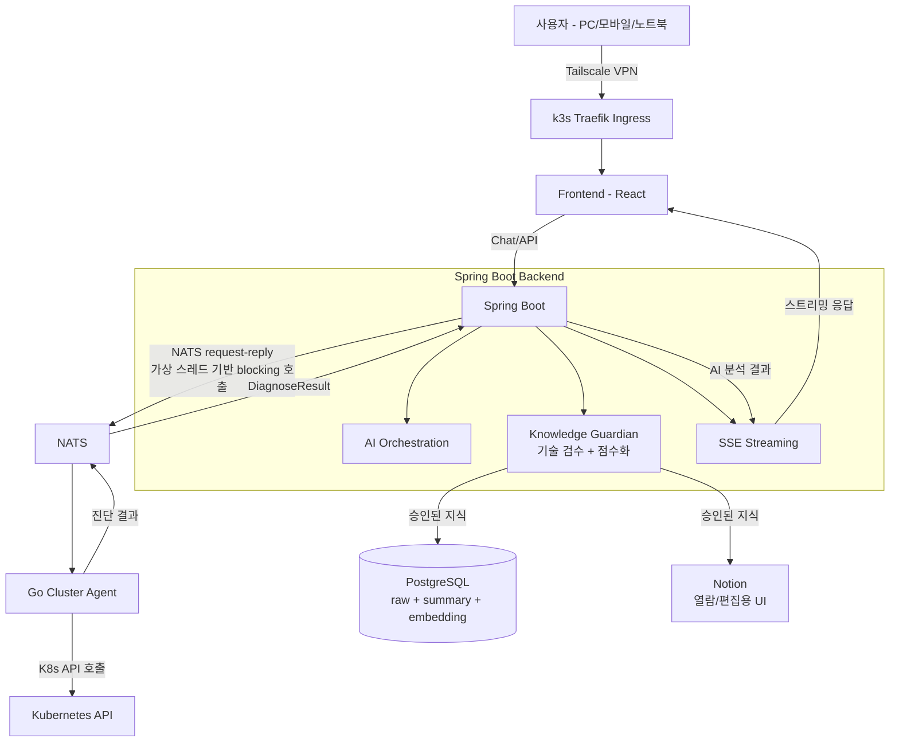

# Architecture

## 전체 구성도

## 핵심 흐름

### 1. K8s 장애 진단 요청

사용자가 채팅창에 장애 상황을 입력하면, 아래 순서로 처리됩니다.

1. React 프론트엔드 → k3s Traefik Ingress → Spring Boot로 요청 전달
2. Spring Boot가 NATS를 통해 Go Cluster Agent에 진단 요청을 보냄
   - **NATS request-reply 패턴**을 사용하며, 가상 스레드(Virtual Thread)가 이 blocking 호출을
     직접 수용하는 구조입니다. Reactor 같은 별도의 비동기 레이어 없이도, 가상 스레드 덕분에
     블로킹 코드를 그대로 쓰면서도 스레드 자원을 효율적으로 사용할 수 있습니다.
   - 요청에는 `trackingId`가 포함되어 요청-응답 추적이 가능합니다.
   - 타임아웃(10초)이 지나면 `TIMEOUT` 상태로, NATS 연결 자체가 끊겨 있으면 즉시
     `FAILED` 상태로 응답하여 무한 대기를 방지합니다.
3. Go Cluster Agent가 Kubernetes API를 직접 호출해 실제 클러스터 상태(Pod 상태, 이벤트,
   로그 등)를 조회
4. 조회 결과를 NATS를 통해 Spring Boot로 반환
5. Spring Boot가 AI로 결과를 분석해 진단 내용을 생성
6. SSE를 통해 프론트엔드로 스트리밍 응답

### 2. 지식 저장 (Knowledge Guardian)

1. 사용자가 정리한 Markdown 원문을 지식 저장소에 등록
2. AI가 원문의 기술적 사실관계를 검수하여 이슈를 CRITICAL/WARNING/SUGGESTION으로 분류하고
   100점 만점 점수를 산정 (자세한 내용은 [ADR: AI 기반 기술 검수 시스템](./decisions/00X-ai-knowledge-review.md) 참고)
3. 검수 결과는 항상 사람의 최종 확인이 필요한 `REVIEW_READY` 상태로 전환됨
4. 사용자가 최종 승인하면:
   - PostgreSQL에 원본(raw) · AI 요약(summary) · 임베딩 값 저장
   - Notion에도 별도로 저장 (열람/편집 UI 용도)
   - 두 저장소는 동기화 관계가 아닌 독립적인 저장소로, 한쪽 삭제가 다른 쪽에 영향을 주지 않음

> **현재 상태**: 임베딩 값은 저장되고 있으나, 이를 활용한 RAG 검색 기능은 아직 구현되지
> 않았습니다. 현재는 저장된 지식을 Notion에서 직접 열람하는 방식으로 사용 중이며,
> RAG 검색 구축은 향후 계획(Future Improvements)입니다.

## 기술 스택

| 영역 | 기술 |
|---|---|
| Frontend | React |
| Backend | Spring Boot (가상 스레드 기반) |
| 메시징 | NATS (request-reply) |
| 클러스터 제어 | Go (Cluster Agent) |
| 데이터베이스 | PostgreSQL (+ 임베딩 저장) |
| 외부 연동 | Notion |
| 인프라 | k3s, Traefik, ArgoCD, Helm |
| 접근 | Tailscale VPN |
| 모니터링 | Prometheus, Grafana, Loki |

