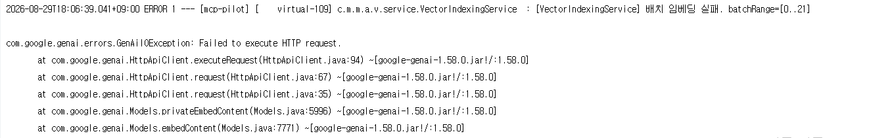
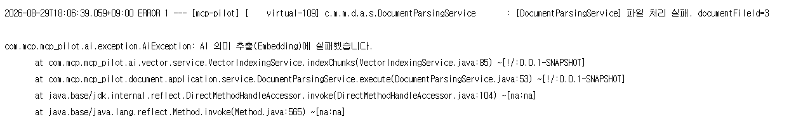
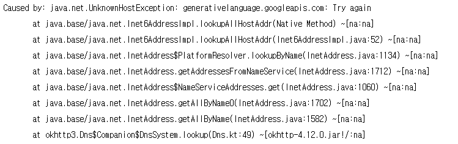
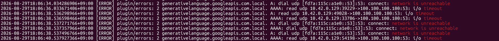

# [Troubleshooting] 대용량 문서 벡터 색인 중 429 Rate Limit 및 CoreDNS DNS Timeout 장애 분석

## 상황

30MB 이상의 대용량 문서(PDF 등)를 업로드하여 RAG 벡터 색인을 수행하는 과정에서 다음과 같은 두 가지 연속적인 장애가 발생했다.

1. **초기 증상 (HTTP 429 Quota Exceeded)**: 청크 수가 많은 문서를 색인할 때 단건 스트림 방식으로 Gemini 임베딩 API를 연속 호출하다가 요청량 제한을 초과하여 `ClientException: 429 You exceeded your current quota` 에러와 함께 색인이 중단됨.
2. **배치 임베딩 적용 후 증상 (DNS 해석 실패)**: 429를 방어하기 위해 청크를 묶어 배치로 전송하던 중, 외부 구글 API 호출 단계에서 `UnknownHostException: generativelanguage.googleapis.com: Try again` 예외가 발생하며 색인이 실패함.





---

## 원인 분석

### 1. 단건 임베딩 호출로 인한 429 (Rate Limit)

기존에는 각 청크(Chunk)마다 개별적으로 Gemini Embedding API를 호출했다.

```text
100 Chunks  ──>  100 HTTP Requests (단시간 연속 호출로 429 Quota Exceeded 발생)
```

대용량 문서의 경우 짧은 시간에 수십~수백 번의 개별 API 요청이 발생하면서 Gemini API의 요청/토큰 제한을 초과했고, 429 에러가 발생했다. 이를 해결하기 위해 여러 청크를 하나의 요청으로 묶는 **Batch Embedding** 방식으로 변경했다.

```text
100 Chunks  ──>  [40] + [40] + [20]  ──>  3 HTTP Requests (요청 횟수 97% 절감)
```

---

### 2. Batch 적용 후 발생한 DNS Timeout 추적

Batch Embedding 적용 후 API 호출 횟수를 대폭 줄였으나, 특정 시점에서 다음 예외가 발생했다.

```text
UnknownHostException: generativelanguage.googleapis.com: Try again
```

처음에는 Google API 서버 장애나 애플리케이션 코드 결함으로 의심했으나, 동일 시각의 Kubernetes `CoreDNS` 파드 로그를 확인한 결과 다음과 같은 오류를 발견했다.

```text
2026-08-29T18:06:36.033 [ERROR] plugin/errors: 2 generativelanguage.googleapis.com.local. AAAA: read udp 10.42.0.129:39229->100.100.100.100:53: i/o timeout
2026-08-29T18:06:38.536 [ERROR] plugin/errors: 2 generativelanguage.googleapis.com.local. A: read udp 10.42.0.129:49028->100.100.100.100:53: i/o timeout
2026-08-29T18:06:38.537 [ERROR] plugin/errors: 2 generativelanguage.googleapis.com.local. A: dial udp [fd7a:115c:a1e0::53]:53: connect: network is unreachable
2026-08-29T18:06:39.041 Spring Boot: UnknownHostException: generativelanguage.googleapis.com: Try again
2026-08-29T18:06:40.537 [ERROR] plugin/errors: 2 generativelanguage.googleapis.com.local. AAAA: read udp 10.42.0.129:54198->100.100.100.100:53: i/o timeout
```



#### DNS 요청 흐름 및 실패 지점

```text
Spring Boot Pod
      │
      │ DNS Query
      ▼
   CoreDNS (10.43.0.10)
      │
      │ forward . /etc/resolv.conf
      ▼
 Upstream DNS (100.100.100.100:53)
      │
      X  i/o timeout (18:06:36 ~ 18:06:40)
      │
      ▼
Spring Boot: UnknownHostException (18:06:39)
```

- **로그 타임스탬프 분석 결과**:
  - Spring Boot에서 `UnknownHostException`이 발생한 시점(`18:06:39`)에 CoreDNS 파드에서 업스트림 DNS(`100.100.100.100:53`)로 보낸 UDP 질의가 `i/o timeout` 및 IPv6 `network is unreachable` 상태였음이 정확히 일치함.
  - 따라서 이번 장애는 Google API 서버의 HTTP 응답 오류가 아니라, **Google API에 HTTP 요청이 도달하기 전 클러스터의 DNS 이름 해석 경로에서 발생한 일시적인 네트워크 타임아웃**임을 확인했다.

---

### 3. Spring AI Retry 동작 특성

이번 `UnknownHostException`은 Spring AI의 기본 Retry 정책의 재시도 대상으로 처리되지 않고 상위 예외로 즉시 전파되었다. 외부 I/O 계층의 일시적인 DNS/네트워크 흔들림에 대응하기 위해서는 코드 레벨에서 명시적인 재시도 방어 전략이 필요했다.

---

## 해결

### 1. 배치 임베딩(Batch Embedding) 및 호출 간격 완화

Gemini 임베딩 API 규격에 맞춰 40개 단위로 청크를 묶어 한 번의 HTTP 요청으로 전송하도록 개선하고, 연속적인 API 호출 부하를 완화하기 위해 배치 간 짧은 지연 시간(`applyDelay`)을 두었다.

### 2. 배치 단위 국소 재시도(`embedBatchWithRetry`) 구현

전체 색인 프로세스를 처음부터 다시 실행하지 않고, 일시적인 DNS 타임아웃이나 네트워크 오류가 발생한 해당 특정 배치(40개)만 2초 대기 후 최대 3회 재시도하는 국소 재시도 로직을 적용했다.

```java
private List<float[]> embedBatchWithRetry(List<String> contents, int fromIndex, int toIndex) {
    for (int attempt = 1; attempt <= MAX_EMBED_ATTEMPTS; attempt++) {
        try {
            return embeddingModel.embed(contents);
        } catch (Exception e) {
            log.warn("[VectorIndexingService] 임베딩 API 일시 실패 (시도 {}/{}). batchRange=[{}..{}] 사유: {}",
                    attempt, MAX_EMBED_ATTEMPTS, fromIndex, toIndex, e.getMessage());

            if (attempt == MAX_EMBED_ATTEMPTS) {
                log.error("[VectorIndexingService] 임베딩 API 최종 실패. batchRange=[{}..{}]", fromIndex, toIndex, e);
                throw new AiException(ErrorCode.AI_EMBEDDING_FAILURE, e);
            }

            try {
                TimeUnit.SECONDS.sleep(2);
            } catch (InterruptedException ie) {
                Thread.currentThread().interrupt();
                throw new AiException(ErrorCode.AI_EMBEDDING_FAILURE, ie);
            }
        }
    }
    throw new AiException(ErrorCode.AI_EMBEDDING_FAILURE);
}
```

### 3. 프론트엔드 업로드 타임아웃 연장 (15초 -> 120초)

대용량 파일 전송 및 R2 업로드 소요 시간을 고려하여 Axios 업로드 타임아웃을 120초로 연장하고 에러 핸들링을 세분화했다.

---

## 교훈

- **추측이 아닌 타임스탬프 기반 인과관계 검증**:
  - `Gemini API 장애?` → `Spring AI 설정 문제?` → `OS 라이브러리 이슈?` 등의 추측에 머무르지 않고, **Spring Boot 에러 로그(`18:06:39`)와 CoreDNS 로그(`18:06:36~40`)의 타임스탬프를 1:1로 정밀 대조**하여 클러스터 DNS 경로의 업스트림 타임아웃을 사실을 확인했다.
- **외부 AI API 연동 시 장애 격리(Fault Isolation) 설계**:
  - 클러스터 DNS나 외부 네트워크가 일시적으로 흔들리더라도 수십 MB짜리 대용량 문서 전체의 색인이 취소되지 않도록, **실패한 배치만 국소적으로 재시도하는 회복 탄력성(Resilience)** 설계가 필수적이다.
- **배치 처리를 통한 외부 API Quota 보호**:
  - 단건 호출 스트림을 배치 구조로 전환하여 HTTP 왕복 비용과 API 호출 횟수를 대폭 절감하고 시스템 안정성을 확보했다.
